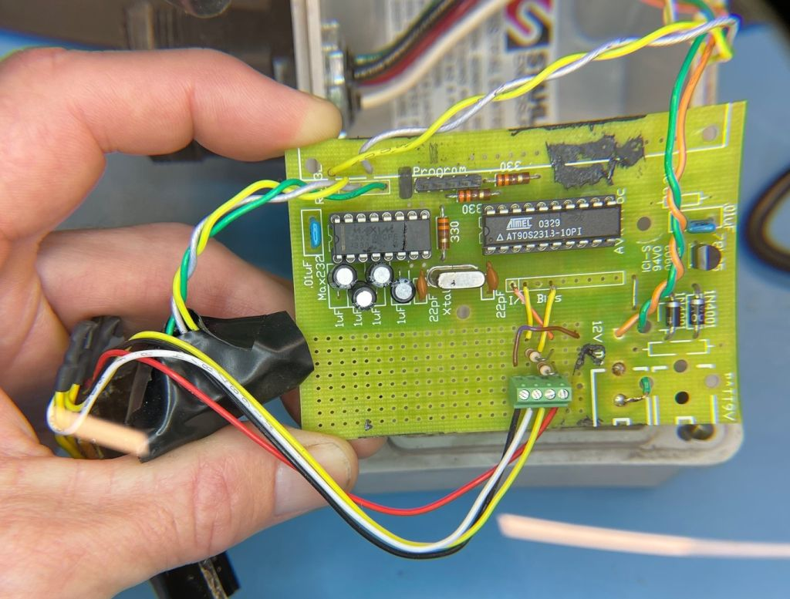
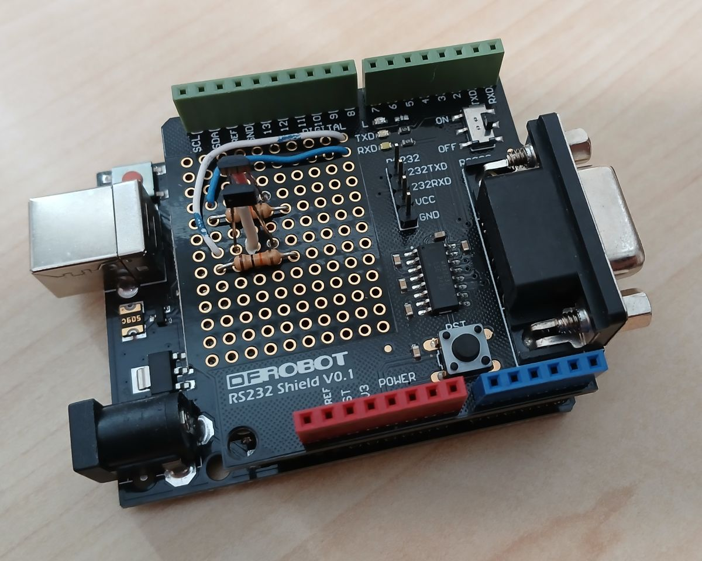
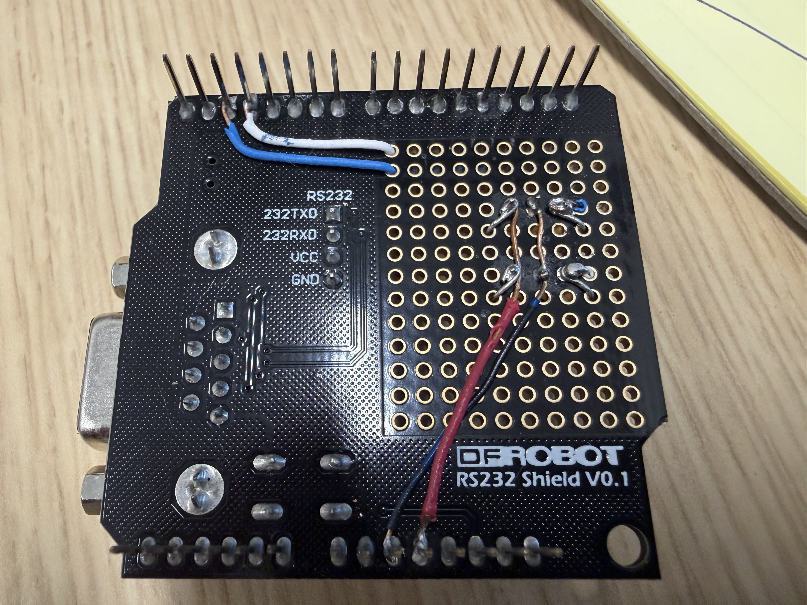

# Pier_Sheave_Counter
A counter for a DIY magnetic quadrature encoder that measures cable movement 
on a mechanism that suspends science stuff from a pier.

The counter keeps track of the rotations of a sheave full of magnets and makes
the position available to a computer through an RS-232C connection. 

There has been an older counter system, custom made with parts available at the 
time, working for over 20 years. This repository holds information to make a
newer counter using genuine cheap off-the-shelf imitation parts. 

## The Old Board
If you're a student, it's probably older than you are.

## The New Board
A very simple circuit kludged together from an Arduino&trade; Uno clone, 
a DFRobot&trade; RS232 Shield, a couple of generic omnipolar Hall effect
switches, and stuff lying around in leftover parts boxes. 

Feed it about 7 -- 12 Volts through the Uno power socket, connect an RS-232C
cable to the shield, ensure everything is in a watertight container, and
Robert will be your uncle.

## Software
It's a very simple one-file Arduino sketch in the `pier_sheave` folder. 
It was tested using the Arduino IDE Version 2. 
